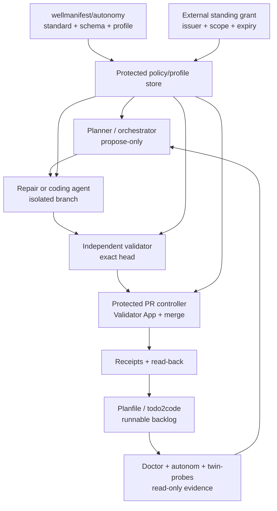

# Architecture and adoption

## Boundary

Wellmanifest publishes the policy contract. Subactor and Semcod implement it.
This prevents a standards repository from becoming a second runtime source of
truth.

## Trust zones

The system has four relevant trust zones:

1. **Candidate zone** — implementer checkout, no merge credentials, no live
   secret store, write access only to the ticket branch.
2. **Validation zone** — fresh checkout of exact head, protected test profile,
   no candidate write access, ability to emit only a verdict/attestation.
3. **Publication zone** — GitHub App or equivalent protected controller with
   narrowly scoped review and merge authority; no general coding role.
4. **Authority zone** — standing grant, revocation, policy/profile digest, kill
   switch, and allowlists, all outside the candidate checkout.

An LLM may participate in observation, planning, implementation, or advisory
review, but it does not move an operation between trust zones.

## Adoption contract

An adopter should place a manifest such as `.wellmanifest/autonomy.json` in the
project, while the protected controller stores or resolves an authoritative
copy of the grant and selected profile. The repository copy is reviewable
intent; the protected copy decides effects.

Recommended adoption order:

1. Pin `wellmanifest/autonomy` and the selected profile by immutable revision
   and digest.
2. Configure one durable task queue and deterministic runnable predicate.
3. Register exact agent principals and separate candidate, validation, and
   publication credentials/workspaces.
4. Install protected required checks and a Validator App.
5. Start with observation-only and dry-run cycles.
6. Issue a short-lived grant for low-risk paths and a small change budget.
7. Prove exact-head validation, auto-merge, read-back, revocation, and rollback
   in an isolated pilot.
8. Expand only through a new externally issued grant based on audit evidence.

## Subactor and Semcod mapping

The shipped profile maps existing products as follows:

| Stage | Primary products | Boundary |
|---|---|---|
| Observe/evidence | `subactor/autonom`, `subactor/twin-probes`, `semcod/todo2code`, Code DSL/LSP | Read-only; claims retain provenance |
| Plan/queue | `subactor/orchestrator`, `subactor/skills-agent`, `semcod/planfile`, `semcod/todo2code` | Known capabilities and runnable tasks only |
| Implement | `subactor/repair-agent`, Autonom coding agent, `subactor/onedev-agent`, `semcod/koru`, bounded `semcod/repatch` | Isolated candidate branch; no approval identity |
| Validate | `subactor/validator-agent`, `subactor/autonomy-lab`, OneDev PR verifier, `semcod/vallm` and deterministic Semcod analyzers | Fresh exact-head checkout; LLM verdict advisory until protected attestation |
| Publish | Autonom PR controller, protected OneDev/GitHub App, `semcod/goal` | Same-repository PR, current base, trusted identity |
| Audit/continue | receipts, Planfile lifecycle, todo2code evidence graph | Verified close, deduplication, next runnable task |

`semcod/fixop` is not enabled for routine code autonomy because its
infrastructure effects cross the default excluded boundary. `semcod/heal`
provides redacted diagnosis only; arbitrary generated shell suggestions are not
an allowlisted capability. `semcod/repatch` is limited to declared UI files and
safety-validated patch options.

## Protected configuration

The following values must not be controlled solely by a candidate branch:

- grant status, issuer, scope, expiry, and revocation;
- selected profile digest and required-check definitions;
- trusted validator and publisher identities;
- branch protection/rulesets and auto-merge settings;
- kill switch, cost budget, and credential bindings;
- validator attestation verification keys or issuer policy.

A repository PR may propose a change to these values, but that proposal is an
authority-policy change and is excluded from the default standing grant.
