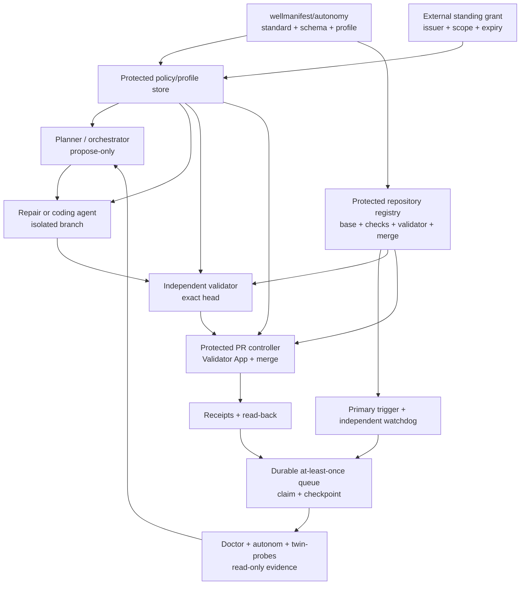

# Architecture and adoption

## Boundary

Wellmanifest publishes the policy contract. Subactor and Semcod implement it.
This prevents a standards repository from becoming a second runtime source of
truth.

## Trust zones

The system has five relevant trust zones:

1. **Execution zone** — protected dispatcher, durable queue/checkpoint and a
   watchdog under a different principal; no candidate or merge authority.
2. **Candidate zone** — implementer checkout, no merge credentials, no live
   secret store, write access only to the ticket branch.
3. **Validation zone** — fresh checkout of exact head, protected test profile,
   no candidate write access, ability to emit only a verdict/attestation.
4. **Publication zone** — GitHub App or equivalent protected controller with
   narrowly scoped review and merge authority; no general coding role.
5. **Authority zone** — standing grant, revocation, policy/profile digest,
   repository registry, kill switch, and allowlists, all outside the candidate
   checkout.

An LLM may participate in observation, planning, implementation, or advisory
review, but it does not move an operation between trust zones.

## Adoption contract

An adopter should place a manifest such as `.wellmanifest/autonomy.json` in the
project, while the protected controller stores or resolves an authoritative
copy of the grant and selected profile. The repository copy is reviewable
intent; the protected copy decides effects.

Recommended adoption order:

1. Pin `wellmanifest/autonomy` and the selected profile by immutable revision
   and digest.
2. Configure one durable at-least-once task queue, checkpoint store,
   idempotency keys, and deterministic runnable predicate.
3. Configure a protected primary trigger and an independently credentialed
   watchdog that recovers missed delivery.
4. Register exact agent principals and separate candidate, validation, and
   publication credentials/workspaces.
5. Compile all repository/base/check/validator/merge bindings from one protected
   digest-bound registry and reject projection drift.
6. Install protected required checks and a Validator App.
7. Start with observation-only and dry-run cycles.
8. Issue a short-lived grant for low-risk paths and a small change budget.
9. Prove automatic trigger delivery, recovery, exact-head validation, explicit
   App merge, read-back, branch cleanup, revocation, and rollback with a live
   low-risk canary. A manual dispatch does not satisfy this step.
10. Expand only through a new externally issued grant based on audit evidence.

## Subactor and Semcod mapping

The shipped profile maps existing products as follows:

| Stage | Primary products | Boundary |
|---|---|---|
| Dispatch/claim | `subactor/autonom` execution plane and protected watchdog | Durable at-least-once delivery; idempotent claim; manual runs are diagnostic only |
| Observe/evidence | `subactor/autonom`, `subactor/twin-probes`, `semcod/todo2code`, Code DSL/LSP | Read-only; claims retain provenance |
| Plan/queue | `subactor/orchestrator`, `subactor/skills-agent`, `semcod/planfile`, `semcod/todo2code` | Known capabilities and runnable tasks only |
| Implement | `subactor/repair-agent`, Autonom coding agent, `subactor/onedev-agent`, `semcod/koru`, bounded `semcod/repatch` | Isolated candidate branch; no approval identity |
| Validate | `subactor/validator-agent`, `subactor/autonomy-lab`, OneDev PR verifier, `semcod/vallm` and deterministic Semcod analyzers | Fresh exact-head checkout; LLM verdict advisory until protected attestation |
| Publish | Autonom PR controller, protected OneDev/GitHub App, `semcod/goal` | Same-repository PR, current base, trusted identity |
| Audit/continue | receipts, checkpoints, Planfile lifecycle, todo2code evidence graph | Verified close, deduplication, repository-isolated result, next runnable task |

`semcod/fixop` is not enabled for routine code autonomy because its
infrastructure effects cross the default excluded boundary. `semcod/heal`
provides redacted diagnosis only; arbitrary generated shell suggestions are not
an allowlisted capability. `semcod/repatch` is limited to declared UI files and
safety-validated patch options.

## Protected configuration

The following values must not be controlled solely by a candidate branch:

- grant status, issuer, scope, expiry, and revocation;
- selected profile digest and the single repository registry digest;
- base branches, required-check definitions, validator identities, and merge policies;
- trusted validator and publisher identities;
- branch protection/rulesets and native auto-merge disablement;
- primary trigger, queue/checkpoint, watchdog credential, and canary freshness;
- kill switch, cost budget, and credential bindings;
- validator attestation verification keys or issuer policy.

A repository PR may propose a change to these values, but that proposal is an
authority-policy change and is excluded from the default standing grant.

## Observed runtime reference: 2026-08-14

The first fresh Subactor canary was delivered by the user-level
`subactor-pr-controller.timer`; no person started the controller or the
Validator workflow. The controller used GitHub's `workflow_dispatch` transport
to invoke Validator, but the preceding durable trigger and claim receipts bind
the origin to `systemd-timer`, so `manual_dispatch=false` is justified by the
receipt chain rather than inferred from the transport name.

| Evidence | Immutable binding |
|---|---|
| Pull request | `subactor/autonom#13` |
| Trigger receipt | `0ddacec437cce96f08a8d918835665a1a07895864c0eaac3e49b4ce8791d0b1c` at `2026-08-14T17:21:03.130Z` |
| Exact operation | `subactor/autonom`, `ticket-006`, `autonom-ticket-006-liveness`, head `2f3071fd60002c68ac32878184bcb7633ab16d5e`, `protected-merge` |
| Idempotency/checkpoint key | `947bc4361a3861d415a69eff52f536316aede93e7401ef63e4268a2cd6a73557` |
| Protected registry | `sha256:b2da44c7da86c13b57eb378b6f105eb4e876778245e11b7002eece5eb52fad5e` |
| Validator run | `31823596201` |
| Exact-head App approval | review `4939687694`, `ifuri-validator-agent[bot]`, exact head above |
| Explicit App merge | merge commit `0d73709d04231b6ad7f9f6d07eb1f92d2fc42d37` at `2026-08-14T17:22:59Z` |
| Cleanup and canary | head branch deleted; canary receipt `fd960b35a9816246aec2629f619cf9ce42e68892fb8bab806697768f4ab795e2` |

This run proves primary-trigger delivery and a complete protected publication
path. It also exposed a deployment defect: its 15-minute claim lease did not
outlive the controller's 45-minute service timeout. That observation produced
the normative lease relation and filesystem durability/recovery rules in
Autonomy 0.2, followed by runtime hardening in `subactor/autonom#14`.

The next automatic timer cycle exercised that hardened runtime against exact
head `58665c0632c9b89f9db48a0a540910bb7a7152e9`. Claim
`aaa4a4018f50286027422cf1f53350082e4807954e0d5aa0ad7c94d273ba8a69`
was acquired at `2026-08-14T17:31:51.475Z` with expiry at
`2026-08-14T18:21:51.453Z`, giving a 50-minute lease for a service bounded to
45 minutes. Validator run `31824419531` approved the exact head in App review
`4939758197`, explicitly merged it as
`54b4bfce39e04603fbdfa84b83c302a2d497432e`, read the result back, deleted the
head branch and committed a checkpoint containing all eight underlying receipt
classes. This was live durability/publication evidence, not a replacement
liveness canary, because its correlation ID was not the configured canary ID.

The protected registry schedules an independent Validator watchdog for every
Subactor controller target, and deterministic tests cover the recovery policy.
No live missed-trigger watchdog recovery had been observed at this evidence
cut. Therefore this record alone MUST NOT be presented as full operational
conformance: that claim additionally requires a fresh canary under the hardened
lease and an observed independent watchdog recovery, as required by section 14.
