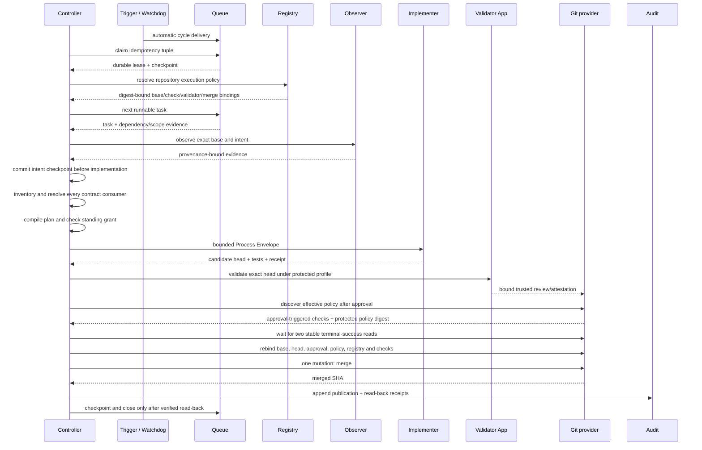

# Autonomous continuation logic

## Main state flow

```mermaid
stateDiagram-v2
    [*] --> Dispatch
    Dispatch --> Claim: protected automatic delivery
    Dispatch --> Degraded: trigger silence
    Degraded --> Claim: independent watchdog recovery
    Claim --> Observe: idempotent lease acquired
    Observe --> Evidence
    Evidence --> Plan: fresh runnable candidate
    Evidence --> Waiting: no candidate / unknown
    Plan --> IntentCheckpoint: bounded scope + accepted base
    IntentCheckpoint --> GrantCheck: committed before implementation
    GrantCheck --> IsolatedEdit: active + in scope + budget
    GrantCheck --> Escalated: expired / revoked / excluded
    IsolatedEdit --> DeterministicValidate
    DeterministicValidate --> IndependentValidate: pass
    DeterministicValidate --> Repair: bounded failure
    IndependentValidate --> PublishPR: exact-head pass
    IndependentValidate --> Repair: bounded failure
    Repair --> IsolatedEdit: retry available
    Repair --> Escalated: retry exhausted
    PublishPR --> ExactHeadGate
    ExactHeadGate --> SuccessorPR: protected base changed
    SuccessorPR --> IntentCheckpoint: renew base; preserve predecessor
    ExactHeadGate --> IndependentValidate: candidate head changed
    ExactHeadGate --> PostApprovalConvergence: trusted approval
    PostApprovalConvergence --> PostApprovalConvergence: new/pending check; reset stability
    PostApprovalConvergence --> ProtectedMerge: two stable reads + terminal success
    ProtectedMerge --> PostMergeVerify
    PostMergeVerify --> Checkpoint: read-back pass
    Checkpoint --> Continue: durable outcome
    PostMergeVerify --> Reaction: read-back fail
    Continue --> Dispatch: grant active
    Continue --> [*]: stop condition
    Waiting --> [*]
    Escalated --> [*]
    Reaction --> [*]
```



## Decision predicate

```text
AUTONOMOUS_MERGE_ALLOWED =
  automatic_trigger_receipt is fresh
  AND durable_claim is idempotently bound
  AND intent_checkpoint precedes implementation
  AND accepted_base = candidate.intent.accepted_base
  AND contract_consumers = {local, image, compose, hosted_ci, validator}
  AND every contract consumer resolved an exact allowlisted version and passed
  AND protected_registry_digest = resolved_registry_digest
  AND target_repository_outcome is isolated
  AND grant.active(now)
  AND kill_switch = enabled_value
  AND repository + branch + paths + actions are in scope
  AND classified_risk <= grant.risk_ceiling
  AND excluded_effects(change) = none
  AND measured_usage <= all budgets
  AND pull_request.same_repository
  AND pull_request.head = validation.head = approval.head
  AND pull_request.base = current_default_branch_head
  AND policy_digest = protected_policy_digest
  AND profile_digest = protected_profile_digest
  AND deterministic_checks = pass
  AND required_check_provenance uniquely matches protected registry
  AND independent_validator = pass
  AND approval_epoch > every merge-authorizing check inventory snapshot
  AND protected_registry = effective_repository_policy
  AND two stable protected reads bind the same complete required check set
  AND every post-approval required check = authoritative_terminal_success
  AND unresolved_critical_findings = 0
  AND implementer != validator != publisher
  AND native_platform_auto_merge = disabled
```

If any operand is false or unknown, merge is denied. Unknown never defaults to
permission.

## One-mutation controller cycle



The next cycle may select the next task. Opening a PR, deleting a proven
equivalent superseded branch, explicitly closing a still-open PR, merging,
rolling back, or changing a ticket are separate requested mutations. A provider
may couple PR closure to the branch-delete operation; that is recorded as one
provider effect only after complete read-back, never treated as permission to
bundle another request. Unresolved work keeps both branch and open PR.

## Failure handling

| Condition | Required result |
|---|---|
| No fresh runnable item | `waiting` or `no_candidate`; no mutation |
| Primary trigger is silent | `degraded`; independent watchdog enqueues/reconciles a cycle |
| Manual dispatch succeeds | diagnostic path evidence only; liveness remains unproven |
| Duplicate delivery | reuse the idempotency tuple and resume from checkpoint; no duplicate effect |
| Registry projection drifts | stop the affected repository before claim or publication |
| Effective ruleset/branch policy differs from registry | fail closed; repair the protected registry or repository policy before approval/merge |
| Unrelated matrix target fails | preserve aggregate failure visibility; do not block a passing target's own gates |
| Canary is stale or incomplete | operational conformance is false until a fresh automatic canary completes |
| Head changes after validation | invalidate approval and validate new head |
| Base changes before merge | preserve the candidate; open a successor PR from a renewed accepted base and revalidate every gate |
| Contract consumer is missing or resolves an unknown version | fail closed before that consumer executes |
| Same-named checks have ambiguous provenance | fail closed; do not count aggregate or non-authoritative status |
| Approval-triggered check is absent before review | defer only that circular check; require all non-circular checks to pass before approval |
| Approval triggers a new required check | require a fresh attempt after the approval timestamp, then two stable terminal-success reads before merge |
| First merge attempt precedes policy convergence | bounded retry is allowed only for unchanged head/base after convergence |
| Superseded branch has complete integrated lossless proof | request deletion while PR is open; read back branch absence, closed/unmerged state and preserved archive head; explicitly close later only if still open |
| Superseded branch has unresolved unique content | preserve branch and keep predecessor PR open as owner |
| Provider API is rate-limited | `degraded`; bounded fallback only with identical authority and subject bindings |
| Grant expires or is revoked | stop mutation, release lease, preserve evidence |
| Budget or retries exhausted | one deduplicated escalation receipt |
| Required check is missing/unknown | fail closed; never infer success |
| Read-back fails | reaction/rollback task; merged task remains unverified |
| Validator or publisher identity overlaps implementer | critical separation failure |
| Proposed policy/grant change | excluded effect; external authority required |
| Native auto-merge is enabled | block publication; require protected explicit App merge |

## Autonomy evolution

The fleet may propose improvements to its tools or policy, but those proposals
use a separate lifecycle: observe → candidate → canary → independent evidence →
external promotion. A green canary means promotion eligibility, not authority.
The default development grant never promotes its own new capability or widens
its own scope.
