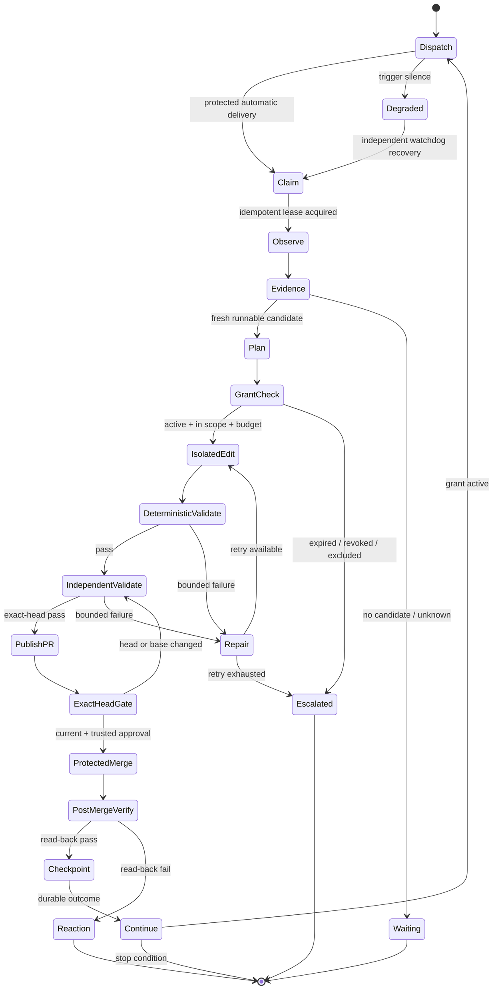
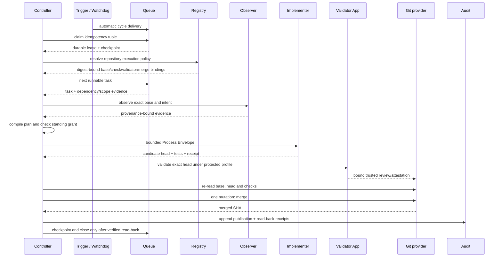

# Autonomous continuation logic

## Main state flow



## Decision predicate

```text
AUTONOMOUS_MERGE_ALLOWED =
  automatic_trigger_receipt is fresh
  AND durable_claim is idempotently bound
  AND protected_registry_digest = resolved_registry_digest
  AND target_repository_outcome is isolated
  AND grant.active(now)
  AND kill_switch = enabled_value
  AND repository + branch + paths + actions are in scope
  AND classified_risk <= grant.risk_ceiling
  AND excluded_effects(change) = none
  AND measured_usage <= all budgets
  AND pull_request.same_repository
  AND pull_request.head = validation.head = approval.head
  AND pull_request.base = current_default_branch_head
  AND policy_digest = protected_policy_digest
  AND profile_digest = protected_profile_digest
  AND deterministic_checks = pass
  AND independent_validator = pass
  AND unresolved_critical_findings = 0
  AND implementer != validator != publisher
  AND native_platform_auto_merge = disabled
```

If any operand is false or unknown, merge is denied. Unknown never defaults to
permission.

## One-mutation controller cycle



The next cycle may select the next task. Opening a PR, closing a superseded PR,
merging, rolling back, or changing a ticket are separate mutations and must not
be bundled into the same controller cycle.

## Failure handling

| Condition | Required result |
|---|---|
| No fresh runnable item | `waiting` or `no_candidate`; no mutation |
| Primary trigger is silent | `degraded`; independent watchdog enqueues/reconciles a cycle |
| Manual dispatch succeeds | diagnostic path evidence only; liveness remains unproven |
| Duplicate delivery | reuse the idempotency tuple and resume from checkpoint; no duplicate effect |
| Registry projection drifts | stop the affected repository before claim or publication |
| Unrelated matrix target fails | preserve aggregate failure visibility; do not block a passing target's own gates |
| Canary is stale or incomplete | operational conformance is false until a fresh automatic canary completes |
| Head changes after validation | invalidate approval and validate new head |
| Base changes before merge | rebuild/rebase through an allowlisted path and revalidate |
| Grant expires or is revoked | stop mutation, release lease, preserve evidence |
| Budget or retries exhausted | one deduplicated escalation receipt |
| Required check is missing/unknown | fail closed; never infer success |
| Read-back fails | reaction/rollback task; merged task remains unverified |
| Validator or publisher identity overlaps implementer | critical separation failure |
| Proposed policy/grant change | excluded effect; external authority required |
| Native auto-merge is enabled | block publication; require protected explicit App merge |

## Autonomy evolution

The fleet may propose improvements to its tools or policy, but those proposals
use a separate lifecycle: observe → candidate → canary → independent evidence →
external promotion. A green canary means promotion eligibility, not authority.
The default development grant never promotes its own new capability or widens
its own scope.
